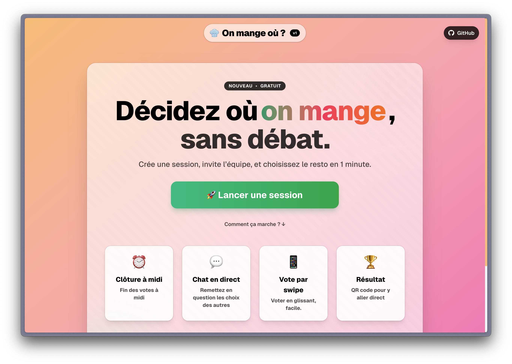

# On Mange Où ? 🍽️

[](https://makeapullrequest.com)


Discover a place for lunch with your team in seconds. Swipe to vote, see the live leaderboard, and chat in real time. Built for speed, fun, and mobile.



---

## ✨ Features

- __Real-time rooms__: join a room and see live updates via `socket.io`
- __Swipe-style voting__: quickly vote OUI/NON on restaurants
- __Live leaderboard__: top picks update instantly
- __Built‑in chat__: lightweight, mobile-first chat with notifications
- __Noon cutoff__: automatic end-of-vote at 12:00 (production)
- __Polished UI__: Tailwind v4, glassmorphism, subtle animations with Framer Motion

## 🚀 Quick start

Prereqs: Node 18+ and `pnpm`.

```bash
pnpm install
pnpm dev
# Next.js dev server on :3000 and Socket.IO server on :3001
```

Open http://localhost:3000 and start a room. A local Socket.IO server runs alongside the app in dev.

## 🔧 Environment

Create `.env.local` from `env.example`:

```bash
cp env.example .env.local
```

- `NEXT_PUBLIC_SOCKET_URL` – Socket.IO server URL used in production.
  - In development it falls back to `http://localhost:3001`.

## 📦 Scripts

- `pnpm dev` – Next.js + Socket.IO dev servers (Turbopack)
- `pnpm build` – Next.js production build
- `pnpm run server:build` – compile Socket.IO server (TypeScript)
- `pnpm run server:prod` – run compiled Socket.IO server (`dist/prod.js`)

## ☁️ Deploy

Frontend (Next.js):
- Deploy on Vercel. No special config needed.

Realtime server (Socket.IO):
- Deploy on Railway/Fly/Render. Expose port `3001`.
- Set `NEXT_PUBLIC_SOCKET_URL` in Vercel to your server URL (e.g. `https://your-railway-app.railway.app`).

## 🧰 Tech stack

- Next.js 15 (App Router) + React 19
- Tailwind CSS v4
- Framer Motion
- Socket.IO (client + server)
- TypeScript

## 🗺️ Roadmap

- Share presets for city/area filters
- Persist rooms and results (DB)
- Add reactions in chat and message editing
- PWA install + offline cache
- i18n (FR/EN)

## 🤝 Contributing

Contributions are welcome! If you’d like to help:

1. Fork the repo and create a feature branch.
2. Run `pnpm dev` and verify your changes.
3. Open a PR with a clear description and screenshots.

## ⭐ Support

If you like this project, please star the repo and share it with your team.
